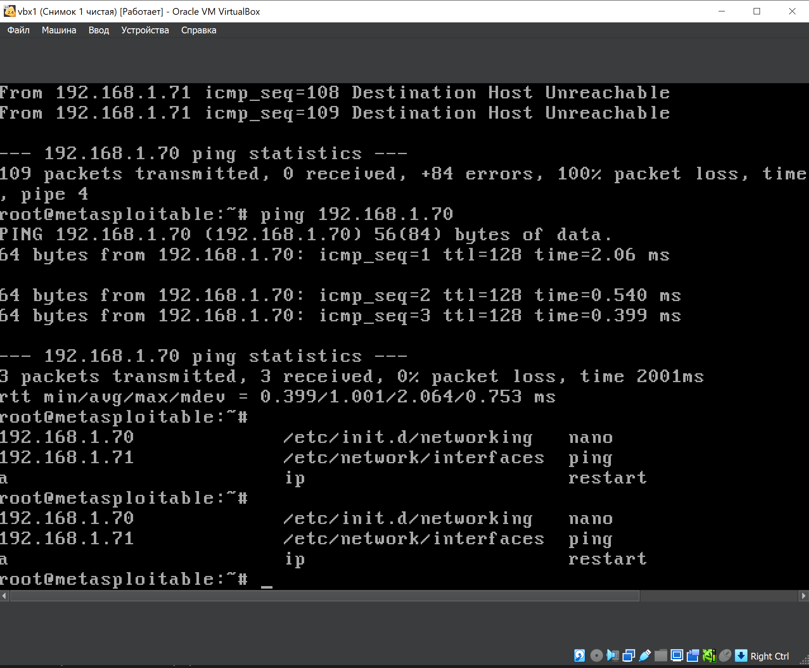
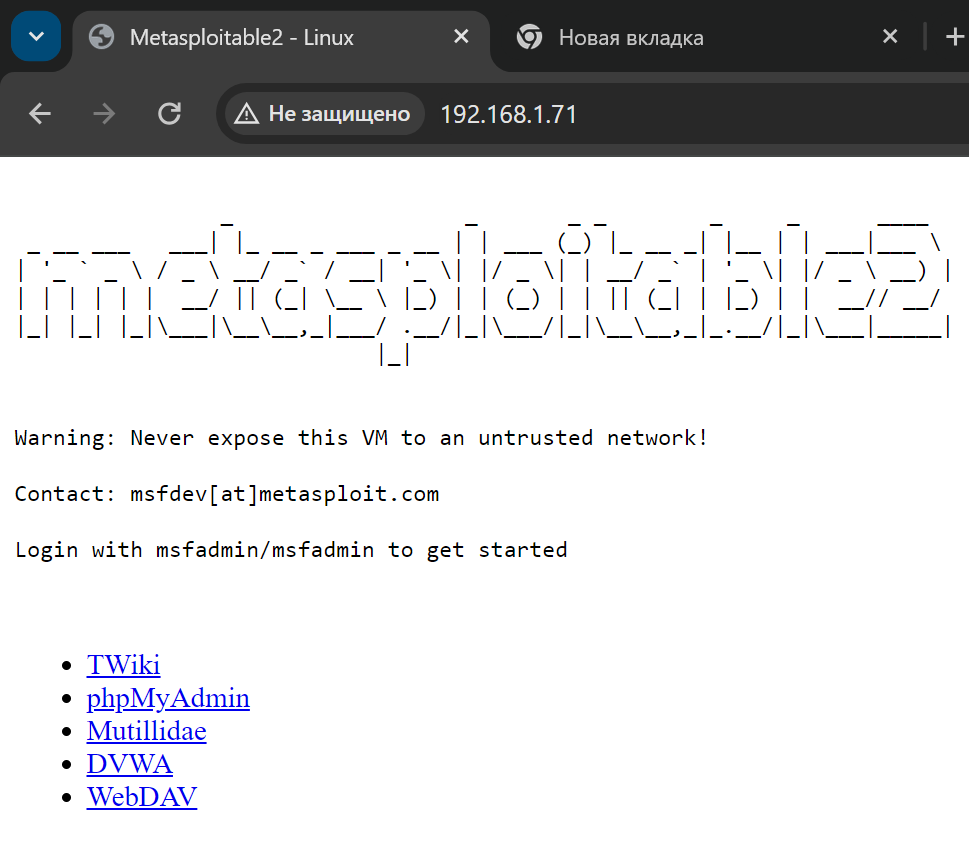
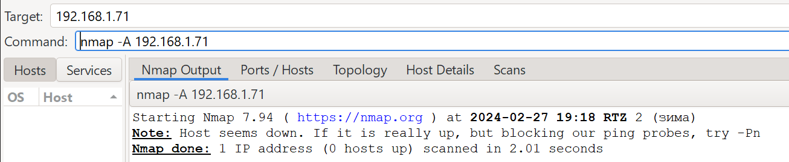
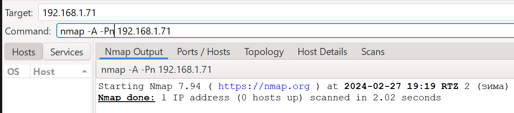
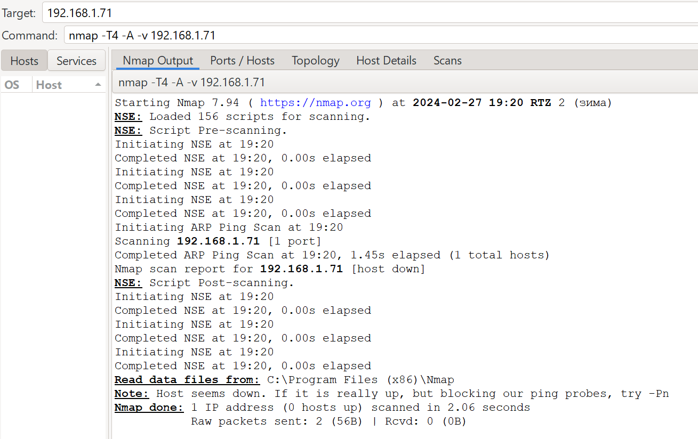
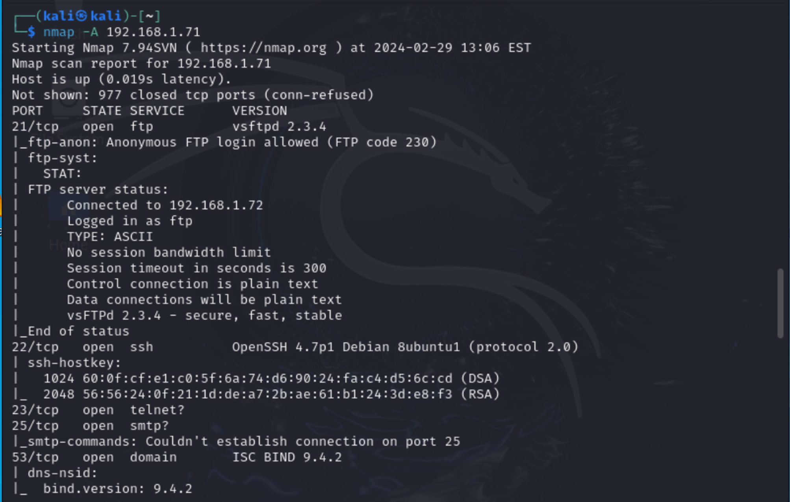
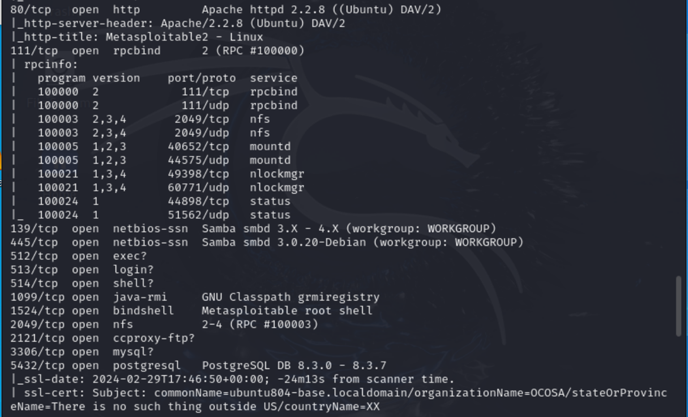
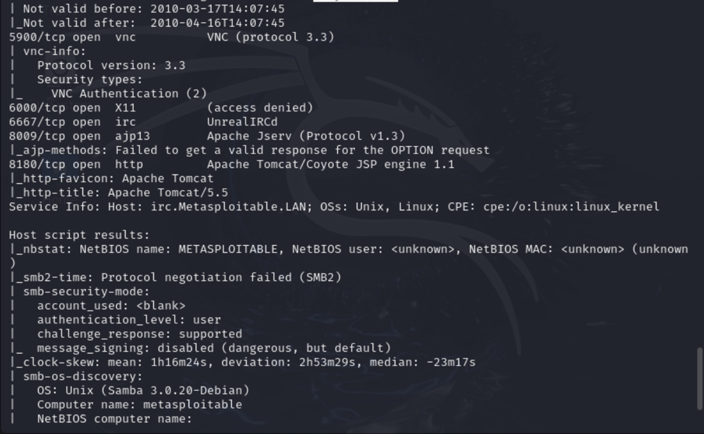
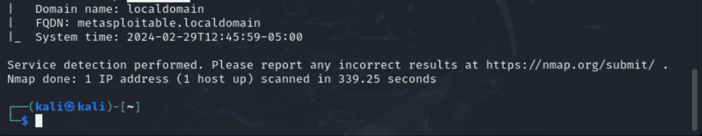
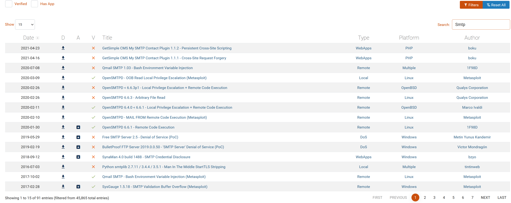

# Домашнее задание к занятию «Уязвимости и атаки на информационные системы» - Илларионов Дмитрий

## Задание 1

Скачайте и установите виртуальную машину Metasploitable: https://sourceforge.net/projects/metasploitable/.

Это типовая ОС для экспериментов в области информационной безопасности, с которой следует начать при анализе уязвимостей.

### Результат

Установил ВМ на виртуал бокс на ПК:

Добился сетевой связанности с ПК - сайт с ПК открывается:

Просканируйте эту виртуальную машину, используя nmap.

Попробуйте найти уязвимости, которым подвержена эта виртуальная машина.

### Результат

Установил nmap на ПК. 
Пробовал по разному запускать сканирование, но, никаких портов не обнаружено:

#### Агрессивное сканирование

Пробую с ключем -Pn - никаких полезных результатов:

Пробу еще вариант сканирования 

Похоже никаких результатов - никаких портов и сервисов не обнаружено.

Пробовал запускать и с повышенными правами от администратора. Не помогло.
Отключение антивируса так же не помогло.
В общам на Win nmap не заработал. 
Не понятно почему?

Тогда поставил рядом ВМ с kali linux и там nmap заработал (после того как настроил ip):

---

Сами уязвимости можно поискать на сайте https://www.exploit-db.com/.

Для этого нужно в поиске ввести название сетевой службы, обнаруженной на атакуемой машине, и выбрать подходящие по версии уязвимости.

Ответьте на следующие вопросы:

    Какие сетевые службы в ней разрешены?
    Какие уязвимости были вами обнаружены? (список со ссылками: достаточно трёх уязвимостей)

Приведите ответ в свободной форме.

### Результат сканирования - есть сервисы:

* порт 21 - ftp сервер vsftpd 2.3.4
* порт 22 - OpenSSH 4.7p1 Debian 8ubuntu1 protocol 2.0
* порт 23 - telnet - под вопросом - версия не определена  - не понятно если есть на чем реализовано
* порт 25 - Smtp - под вопросом - не понятно если есть на чем реализовано
* порт 53 - domain ISC BIND 9.4.2
* порт 80 - http  Apache httpd 2.2.8 Ubuntu DAV/2
* порт 111 - rpcbind  2 (RPC #100000)
* и др. - см. скриншот

### Найдены уязвимости

* https://www.exploit-db.com/exploits/49757
* https://www.exploit-db.com/exploits/17491

* по telnet пока точно не понял - версии тел нет нет, но, сам по себе telnet на сколько помню и так не безопасный. на сколько будут уязвимости реально работать не знаю, но ,про телнет - много уязвимостей, например: https://www.exploit-db.com/exploits/50620 

и другие и там еще много других страниц:

* Про SMTP аналогично - в базе много уязвимостей, но, работают ли они - видимо нужно пробовать.

* domain ISC BIND 9.4.2 - https://www.exploit-db.com/exploits/6122 

* по rpcbind  2 (RPC #100000) - точно не понял, возможно - https://www.exploit-db.com/exploits/20376 
* по PostgreSQL две уязвимости как минимум:
** https://www.exploit-db.com/exploits/32849
** https://www.exploit-db.com/exploits/32847
 

## Задание 2

Проведите сканирование Metasploitable в режимах SYN, FIN, Xmas, UDP.

Запишите сеансы сканирования в Wireshark.

Ответьте на следующие вопросы:

    Чем отличаются эти режимы сканирования с точки зрения сетевого трафика?
    Как отвечает сервер?

Приведите ответ в свободной форме.